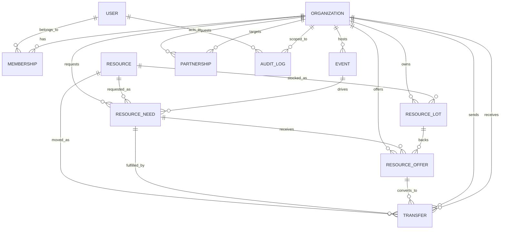
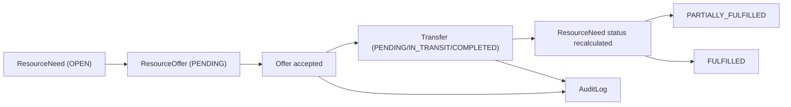

# Graphify

## Project Topology

```text
backend/
|-- prisma/
|   |-- schema.prisma
|   `-- migrations/
|-- src/
|   |-- config/
|   |-- controllers/
|   |-- middleware/
|   |-- routes/
|   |-- schemas/
|   |-- services/
|   |-- tests/
|   |-- utils/
|   |-- app.ts
|   |-- prisma.ts
|   `-- server.ts
|-- package.json
`-- README.md
```

## Runtime Architecture

```mermaid
flowchart TD
    Server["src/server.ts"] --> App["src/app.ts"]

    App --> AuthRoutes["routes/auth.routes"]
    App --> OrgRoutes["routes/organization.routes"]
    App --> UserRoutes["routes/user.routes"]
    App --> MembershipRoutes["routes/membership.routes"]
    App --> PartnershipRoutes["routes/partnership.routes"]
    App --> EventRoutes["routes/event.routes"]
    App --> ResourceRoutes["routes/resource.routes"]
    App --> LotRoutes["routes/resource-lot.routes"]
    App --> NeedRoutes["routes/resource-need.routes"]
    App --> OfferRoutes["routes/resource-offer.routes"]
    App --> TransferRoutes["routes/transfer.routes"]
    App --> AuditRoutes["routes/audit.routes"]
    App --> ErrorHandler["middleware/error.middleware"]

    AuthRoutes --> AuthMiddleware["middleware/auth.middleware"]
    AuthRoutes --> RateLimit["middleware/rate-limit.middleware"]
    OrgRoutes --> AuthzMiddleware["middleware/authorization.middleware"]
    MembershipRoutes --> AuthzMiddleware
    PartnershipRoutes --> AuthzMiddleware
    EventRoutes --> AuthzMiddleware
    LotRoutes --> AuthzMiddleware
    NeedRoutes --> AuthzMiddleware
    OfferRoutes --> AuthzMiddleware
    TransferRoutes --> AuthzMiddleware
    AuditRoutes --> AuthzMiddleware

    AuthRoutes --> AuthController["controllers/auth.controller"]
    OrgRoutes --> OrgController["controllers/organization.controller"]
    UserRoutes --> UserController["controllers/user.controller"]
    MembershipRoutes --> MembershipController["controllers/membership.controller"]
    PartnershipRoutes --> PartnershipController["controllers/partnership.controller"]
    EventRoutes --> EventController["controllers/event.controller"]
    ResourceRoutes --> ResourceController["controllers/resource.controller"]
    LotRoutes --> LotController["controllers/resource-lot.controller"]
    NeedRoutes --> NeedController["controllers/resource-need.controller"]
    OfferRoutes --> OfferController["controllers/resource-offer.controller"]
    TransferRoutes --> TransferController["controllers/transfer.controller"]
    AuditRoutes --> AuditController["controllers/audit.controller"]

    AuthController --> AuthService["services/auth.service"]
    OrgController --> OrgService["services/organization.service"]
    UserController --> UserService["services/user.service"]
    MembershipController --> MembershipService["services/membership.service"]
    PartnershipController --> PartnershipService["services/partnership.service"]
    EventController --> EventService["services/event.service"]
    ResourceController --> ResourceService["services/resource.service"]
    LotController --> LotService["services/resource-lot.service"]
    NeedController --> NeedService["services/resource-need.service"]
    OfferController --> OfferService["services/resource-offer.service"]
    TransferController --> TransferService["services/transfer.service"]
    AuditController --> AuditService["services/audit.service"]

    AuthMiddleware --> UserService
    AuthzMiddleware --> AuthorizationService["services/authorization.service"]

    AuthController --> SafeAudit["utils/safe-audit"]
    OrgController --> SafeAudit
    MembershipController --> SafeAudit
    EventController --> SafeAudit
    NeedController --> SafeAudit
    OfferController --> SafeAudit
    TransferController --> SafeAudit
    SafeAudit --> AuditService

    AuthService --> Prisma["src/prisma.ts"]
    OrgService --> Prisma
    UserService --> Prisma
    MembershipService --> Prisma
    PartnershipService --> Prisma
    EventService --> Prisma
    ResourceService --> Prisma
    LotService --> Prisma
    NeedService --> Prisma
    OfferService --> Prisma
    TransferService --> Prisma
    AuditService --> Prisma
    AuthorizationService --> Prisma

    Prisma --> Database[("PostgreSQL")]
```



## Domain Model



## Critical Fulfillment Flow


